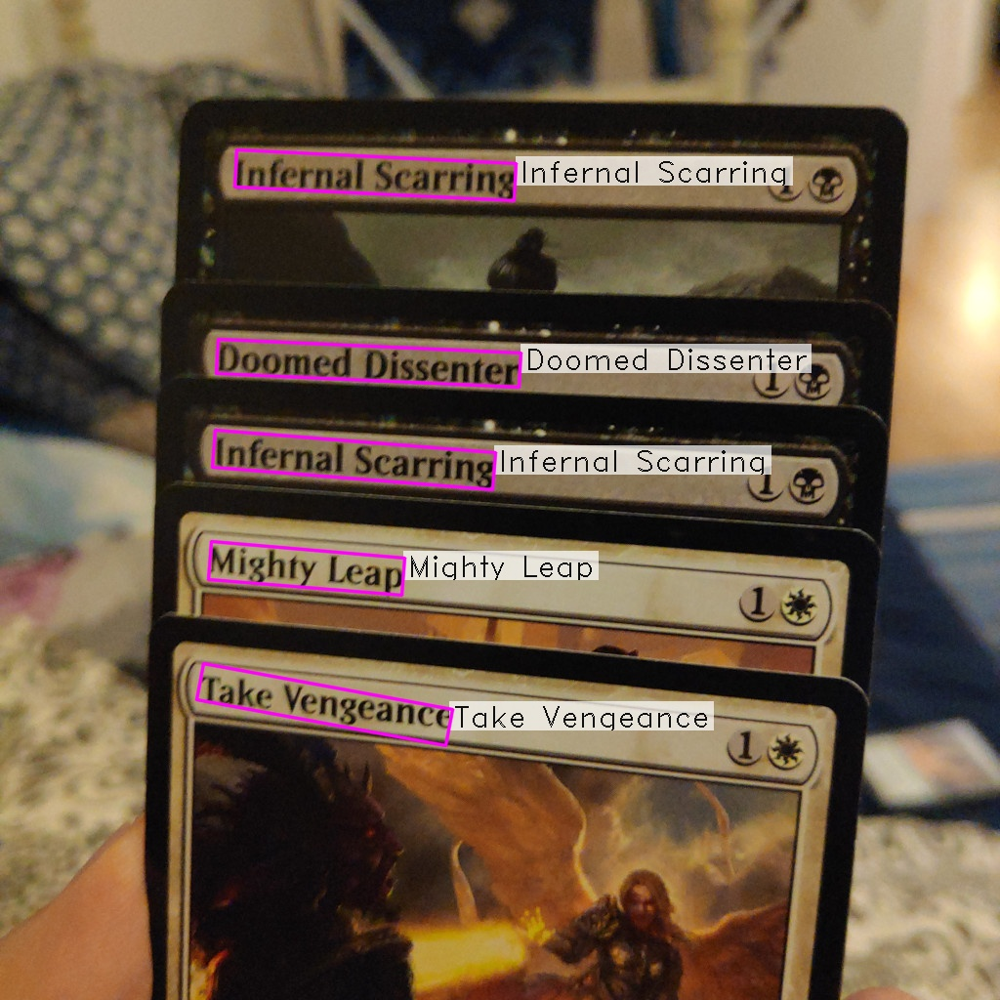
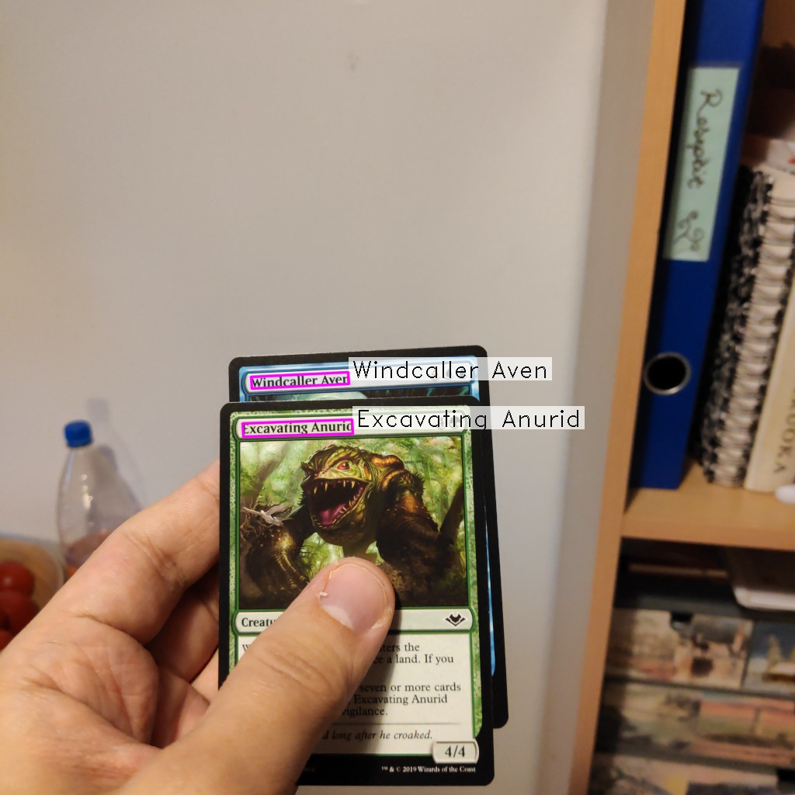
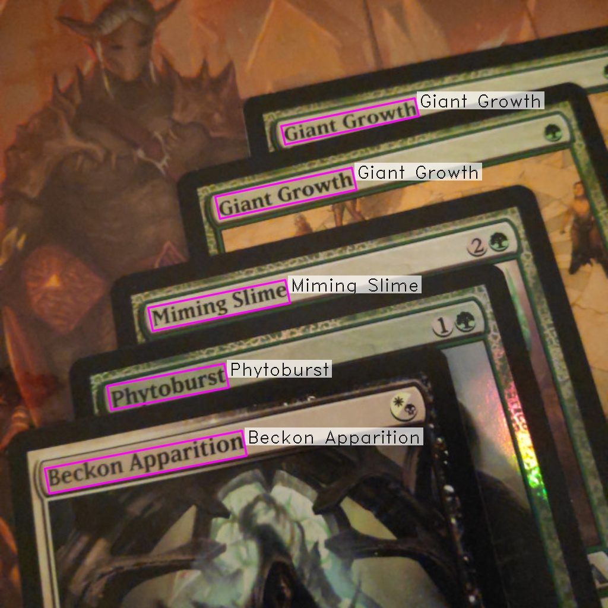
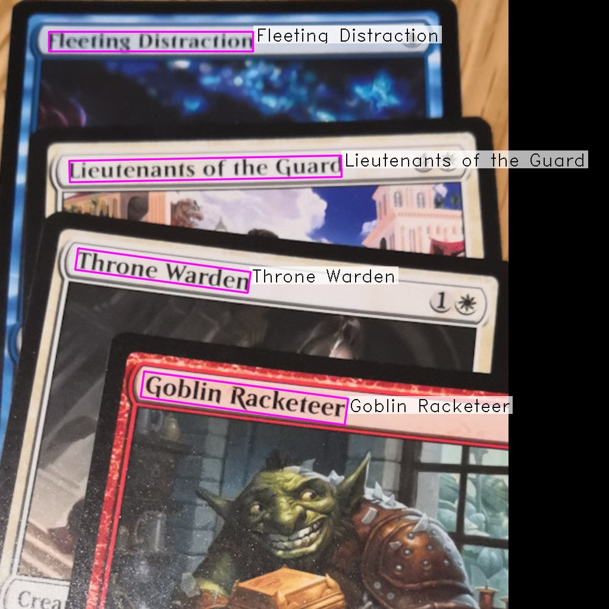

# Visions - MTG card name reader
Recognize Magic: The Gathering (MTG) cards in images by detecting and recognizing their names.

<a href="readme_imgs/1.jpg"></a>
<a href="readme_imgs/2.jpg"></a>
<a href="readme_imgs/3.jpg"></a>
<a href="readme_imgs/4.jpg"></a>

## What is Visions and how does it work?

Visions is a Python 3 and C++ program for recognizing Magic: The Gathering cards in images. It currently recognizes only cards with black text in the name (modern and M15 frames). Expanding to classic white frame cards is the next big step for the program.

The recognition is done by first detecting and then reading the card names in the image. The process can be split in five phases:

1. [FASText points](https://www.cv-foundation.org/openaccess/content_iccv_2015/papers/Busta_FASText_Efficient_Unconstrained_ICCV_2015_paper.pdf) are used to detect connected components that could be parts of a card's name.
2. A [convolutional neural network](https://en.wikipedia.org/wiki/Convolutional_neural_network) classifies the found connected components as parts of card names or noise.
3. [DBSCAN clustering](https://dl.acm.org/doi/10.5555/3001460.3001507) connects found components to form text lines.
4. A [recurrent neural network](https://keras.io/examples/image_ocr/) containing an [LSTM unit](https://dl.acm.org/doi/10.1162/neco.1997.9.8.1735) is used to read the detected text.
5. Language model that uses [SymSpell](https://medium.com/@wolfgarbe/1000x-faster-spelling-correction-algorithm-2012-8701fcd87a5f) to match raw results to card names is used to improve recognition results.

This program is a constructive part of my master's thesis, which will be published some time during the summer of 2020. The thesis contains full details of the implementation in Finnish. A more detailed explanation in English might be added later as a GitHub page or in some other format.

Datasets used in training the neural network models will be published in a separate Git repository.

## Installation
Since Python 3 can be too slow for calculation intensive operations, FASText point and component search and DBSCAN are implemented in C++. The following installation instructions have been tested on a fresh installation of Ubuntu 18.04 LTS.

### Prerequisites

1. Cmake for compilation automation. I [installed Cmake 3.17.3 from source code](https://cmake.org/install/), but any version starting from 3.12 should work.
1. A C++ compiler supporting C++11 standard. I used g++ 7.5.0, which was simply installed with ``sudo apt install g++``.
2. Python 3.6 was used for running the python code. It should be included in Ubuntu 18.04.

### Compile C++ code
1. Install dependencies:
```
sudo apt install python3-dev
sudo apt install python3-numpy
```

2. Compile the code:
```
mkdir build
cd build
cmake ../
cmake --build ./
```
If the compilation was successful, there should now be a file called ``libftpy.so`` in the ``py`` folder of the project.

### Install Python depdencies
1. Create a [virtual environment](https://packaging.python.org/guides/installing-using-pip-and-virtual-environments/) and activate it:
```
sudo apt install python3-venv
python3 -m venv env
source env/bin/activate
```

2. Upgrade pip and setuptools
```
pip install --upgrade pip
pip install --upgrade setuptools
```

3. Install libraries using ``requirements.txt`` file
```
pip install -r requirements.txt
```

## Recognize cards
Now that the installation is complete, you can use ``py/main.py`` to process images from the ``inputs`` folder. Run 
```
python py/main.py
``` 
to process the sample inputs. You can generate visual outputs similar to the images on top of this page by adding a ``--visualize 1`` command line argument:
```
python py/main.py --visualize 1
```
The generated images can be found in a folder called ``outputs``.

### Command line arguments

| Parameter | Purpose | Example | Default value |
| ----------| --------| ------- | ------- |
| ``input`` | Specify input image folder | "inputs" |``python py/main --input my_input_folder`` |
| ``visualize`` | Toggle on visualization output | 0 | ``python py/main --visualize 1`` |
| ``output`` | Specify visualization output folder | "outputs" |``python py/main --visualize 1 --output my_output_folder`` |

## Future improvements

1. The most glaring issue of the implementation is that it *only recognizes cards with black text in names*. White text cards is the first improvement to be done. It should be possible to add the white text cards, by expanding the training data and tweaking the options of FASText.
2. There's no unit tests. Unit tests would be useful for at least FASText code.